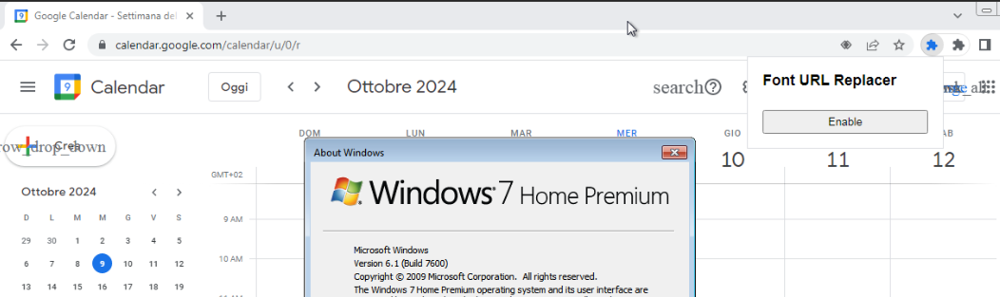
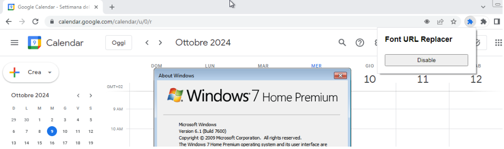

# Chrome Extension - Google Material Icons v142 decoding issue

## Overview

This Chrome extension serves as a temporary workaround for a decoding issue present in some Windows 7 builds.  
It addresses problems related to Google Material Icons - character encoding that may occur when browsing certain websites on affected Windows 7 systems.

## Installation

1. Download the extension files or clone this repository.
2. Open Google Chrome and navigate to `chrome://extensions/`.
3. Enable "Developer mode" in the top right corner.
4. Click "Load unpacked" and select the directory containing the extension files.

## Usage

Once installed, the extension will automatically run on web pages and attempt to fix any detected encoding issues.  
The extension will replace the Google Material Icons v142 with the previous version.

## Screenshot

Disabled state:

Enabled state:

## Disclaimer

This extension is provided as-is, without any warranties. Use at your own risk.

## License

MIT License

## Disclaimer

I discourage you from using Windows 7 as it is no longer supported by Microsoft.  
I discourage you from using Google Chrome as it is no longer supported on Windows 7.  
